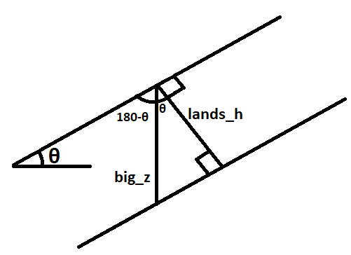
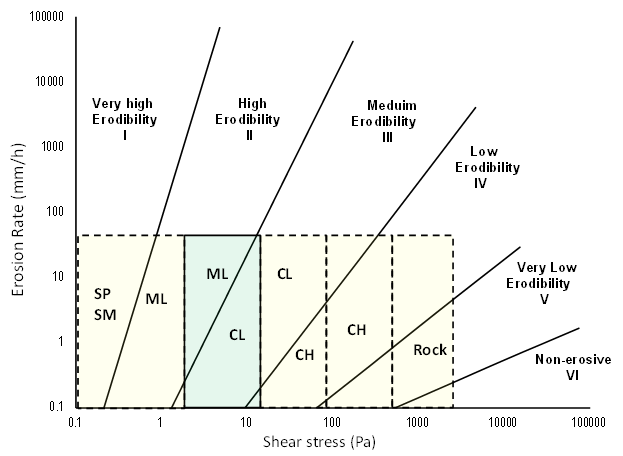

# Blog Updates


+ [March 14: ArcPy and the Critical Rainfall Threshold Model: A How-To Guide](#link5)
+ [March 1: Soil Cohesion and Angle of Friction](#link4)
+ [February 17: Looking at Landslide Density](#link3)
+ [February 17: Python Can Help!](#link2)
+ [February 10: What's in a Landslide Susceptibility Model?](#link1)

## Update 3/14/20 <a name='link5'></a>

### Putting it All Together

We have all our data! Great. Awesome. Incredible. But how are we going to take those data and use them in the critical rainfall threshold model? We could use existing tools such as Raster Calculator, but our solution would be a lot more portable and applicable for future use if we just made an ArcGIS tool for it. That would be really sweet, kinda like a "set it and forget it" type of thing. ArcPy can help us do just that.

### ArcPy

#### What is it???

Well, it's a Python package, a.k.a. a library, a.k.a. a collection of structures and premade methods that make it easier to use Python for geospatial applications. Python is already a pretty commonly used general-purpose language, and it's especially suited to big-data applications, so working with spatial data is just a natural extension of what Python is already good at. The advantage of ArcPy is that it allows us to go under the hood and create our own "Tools" for use in Arc's "Toolboxes". Or we can just bypass Arc entirely and run the tools straight from Python! The beauty of programming is in its versatility.

#### Getting Started

Okay, so every programmer knows that the worst way to write anything is just to open up your handy-dandy, trusty-rusty text editor and start plonking down code into that little keyboard of yours. The syntax of programming languages, library functions, and methods are just too specific and complicated to memorize well enough that you get it perfect on your first try. Plus, when you write a huge thing and then realize it's broken, it's a lot harder to find the broken part than if you just write something small that's broken. Assuming that our first try will be wrong, let's use ArcPro's built-in __Python shell__, which you can find by clicking "Python" under the Analysis tab, to test everything we do on a really granular level before we throw it to the dogs. If you want to follow along, have a look at [this script](crit_rain_thresh.py) by Dr. Davis.

The first thing we need to do is load in the project and set up where our data are coming and going from. `arcpy` is available by default, but we should also `import os` before we do anything.
```
# Setting up my folders
aprx = arcpy.mp.ArcGISProject("CURRENT")
base_dir = os.path.dirname(aprx.filePath)
out_dir = os.path.join(base_dir, "Output")
```
This is pretty self-explanatory. The first line is a constructor for an ArcGISProject class. Classes are the "objects" of object-oriented programming; they allow programmers to represent structures and perform operations on them in a way that can be extended to many different instances of a single type of structure, or more specific versions of that structure. The important thing to understand here is that now your code has set aside space to store an `ArcGISProject` and filled it with a class representing the current project. We are also using OS functions to get directory names and file paths. This is because different operating systems have different naming schemes for their file paths, so rather than try and make something that works for everyone, we'll defer to the OS and let it handle file paths the way it wants to. Our output directory will be set to a subdirectory of the base directory called `Output`.

```
# Define constants
k_pi = 3.14159
gamma_r_nm3 = 20000.0  # unit weight of soil, N/m3
gamma_w_nm3 = 10000.0  # unit weight of water, N/m3

# Define input rasters
lands_h = "soilmu_a_aoi_utm_h"       # depth of regolith, m
lands_phi = "soilmu_a_aoi_utm_psi"   # internal friction angle, deg
lands_c = "soilmu_a_aoi_utm_c"       # soil cohesion, Pa
lands_theta = "collbran_slope"       # hillslope angle, deg

# Define input water depth, m
water_h = .2
```
Here we create variables to store our constants (which are needed for the equation) and the names of our inputs. In Dr. Davis' case, these were datasets about Collbran, CO, but obviously that's only for this application. We're storing these input names in variables so that, when we turn this into a toolbox, we can easily fill those variables with whatever inputs the user provides without having to rewrite any code. We're anticipating portability from the outset!

```
# Create radian version of slope
theta_rad = arcpy.sa.Times(lands_theta, k_pi/180.0)
phi_rad = arcpy.sa.Times(lands_psi, k_pi/180.0)
```
What we're doing here is converting our slope and internal friction angle rasters from degrees to radians, because our model uses those darn trig functions, which are built into Arc (👍), but only take radians (👎). Remember that we defined `k_pi` above as a truncated version of pi. π radians is 180 degrees, so we can just do `lands_theta = lands_theta * k_pi/180`, right? WRONG! `lands_theta` is just a text string containing the name of our raster, and we can't multiply that by any floating-point numbers anyway. We need to multiply _every cell_ of these rasters by `k_pi/180`, and for that, we must defer to the `arcpy.sa.Times` function. It's verbose, but what can you do.

Notice that we're not overwriting `lands_theta` and `lands_psi` with these operations; we're instead storing them in brand new variables. This is just so we can keep the old rasters just in case we need them for something. Even if we overwrote `lands_theta` and `lands_psi`, the rasters themselves would stay anyway, since those variables only contain their names.

Now it's time to throw all this crap in the critical rainfall threshold model. Dr. Davis has written it out nicely for us.
```
# The Critical Rainfall Threshold Model
#
#      tan φ                 C                     ψt * γw * (tan φ)
# Fs = -----  +  -------------------------- - ----------------------------
#      tan θ     γr * H * (sin θ) * (cos θ)    γr * H * (sin θ) * (cos θ)
#
# Fs = Ff     +              Fc             -          Fw
```
As you can see above, he's dubbed the three fractions `Ff`, `Fc`, and `Fw`. It'll be easier for us to calculate those three on their own first, and then put them into the final equation. Let's start things out easy with `Ff`.

```
# STEP - Calculate Ff
ff = arcpy.sa.Divide(arcpy.sa.Tan(phi_rad), arcpy.sa.Tan(theta_rad))
```
`Ff` is the simplest one. As I said above, since we're doing calculations on geospatial datasets, the division sign isn't going to do what we want here, so we have to call some built-in ArcPy functions. Luckily, they already have everything we need built-in so it's really not too bad.

```
# STEP - Calculate Fc
```
Here, things start to get crazy. Let's go line by line. 

```
sin_cos = arcpy.sa.Times(arcpy.sa.Sin(theta_rad), arcpy.sa.Cos(theta_rad))
```
What we're doing here is making the `(sin θ) * (cos θ)` part of the equation. It appears in both `Fc` and `Fw`, so making it its own thing now will help us down the line too.

```
# Soil depth vertical (influenced by gravity)
big_z = arcpy.sa.Divide(lands_h, arcpy.sa.Cos(theta_rad))
```
We need to calculate the vertical soil depth here. The soil depth measured from our raster _is_ the distance from the soil surface to the bedrock, but the problem is that it's measured _perpendicular_ to the slope of the surface. This is fine if we're working with totally flat land, since perpendicular to that would just be straight down, but we're not. So, since we already have all the slopes, we can use cosine to get the vertical slope. If that explanation wasn't sufficient, check out this diagram.



```
h_sin_cos = arcpy.sa.Times(big_z, sin_cos)
c_gr = arcpy.sa.Divide(lands_c, gamma_r_nm3)
fc = arcpy.sa.Divide(c_gr, h_sin_cos)
```
Now we're back into the simple stuff. We multiply our new `H` by `sin_cos` to get `H * (sin θ) * (cos θ)` and store it in `h_sin_cos`. Then we do the `C / γr ` portion of the equation, store it in `c_gr`, and then divide `h_sin_cos` by `c_gr` to get `Fc`. We're in the home stretch! Time to do do `Fw`.

```
# Step - Calculate Fw
# Pressure head parallel to hillslope
ls_psit = arcpy.sa.Times(water_h, arcpy.sa.Cos(theta_rad))
```
It's time to calculate `ψt`. To do this, we have to do something similar to what we did before. We need the water pressure head parallel to the hillslope, so we get that by multiplying the cosine of the slope by the depth to water. 

```
g_wr = gamma_w_nm3/gamma_r_nm3
pgwr = arcpy.sa.Times(ls_psit, g_wr)
pgwrt = arcpy.sa.Times(pgwr, arcpy.sa.Tan(phi_rad))
fw = arcpy.sa.Divide(pgwrt, h_sin_cos)
```
Now we just have to put everything we have together. First we calculate `γw / γr`, then multiply it by `ls_psit` to get `ψt` in the numerator. Then we multiply by `tan φ` to get that in the numerator too. Now all we need is to get ` H * (sin θ) * (cos θ)` in the denominator. Thankfully, we already calculated that in the previous step, so to get it in the denominator we can just divide by `h_sin_cos`. And then we're done with `Fw`! Now for the last step.

```
# Step - calculate Fs
# REMINDER: where fs < 1, UNSAFE
fs = ff + fc - fw
```
Boom! Easy as that. 

#### Creating an ArcGIS Toolbox

Okay, so we did the legwork of calculating `Fs` for Collbran. But if we want to calculate `Fs` for different cities, we should turn it into a tool we can use with ArcMap. To do that, we need to make our own classes... Luckily, the syntax isn't all that different from creating a function. [You can see Esri's toolbox template here](https://pro.arcgis.com/en/pro-app/arcpy/geoprocessing_and_python/a-template-for-python-toolboxes.htm). 
```
class Toolbox(object):
    """
    The class needed for importing as an ArcGIS toolbox.
    """
    def __init__(self):
        """Toolbox class initialization"""
        self.label = "Landslide Analysis"
        self.alias = "Landslides"
        self.tools = [CritRainThresh]
```
Here Dr. Davis has just replaced the empty/default text with his own.

```
class CritRainThresh(object):
    """
    Name:     CritRainThresh
    Features: Creates a factor of safety raster based on the Critical Rainfall
              Threshold Model (Iverson, 2000)
    History:  VERSION 1.0
              - initial attempt at an ArcGIS Toolbox
    Ref:      https://doi.org/10.1029/2000WR900090
    """
    # \\\\\\\\\\\\\\\\\\\\\\\\\\\\\\\\\\\\\\\\\\\\\\\\\\\\\\\\\\\\\\\\\\\\\\\\
    # Class Initialization
    # ////////////////////////////////////////////////////////////////////////
    def __init__(self):
        """
        Name:     CritRainThresh.__init__
        Inputs:   None
        Outputs:  None
        Features: Initialize the tool
        """
        # ArcGIS Tool descriptors
        self.label = "Critical Rainfall Threshold Model"
        self.description = (
            "Creates a factor of safety raster based on the Critical Rainfall "
            "Threshold Model (Iverson, 2000)"
        )
        self.canRunInBackground = False

        # Check that spatial analyst tools extension is enabled
        arcpy.gp.checkOutExtension("spatial")

        # Define constants and default values used in model
        self.k_pi = 3.14159
        self.deg2rad = self.k_pi / 180.0
        self.gamma_r_nm3 = 20000.0  # unit weight of soil, N/m3
        self.gamma_w_nm3 = 10000.0  # unit weight of water, N/m3
```
Most of this is from our earlier script file. This stuff will happen every time you click on the tool in ArcPro, so don't do anything that takes a long time in this. What we're doing here is setting our constants that we used in the script file, making labels and documentation so people know what this is, and checking for the spatial analyst extension (because we're going to use some of its methods). We're also going to set `self.canRunInBackground` to `False`, because everything runs slower if you do background processing, and for our purposes, this is the end result of our project, so there wouldn't be anything else we could work on while this is running.

First, we need to set our parameter info. We're just going to get the parameters (a.k.a. arguments) that the user passes in as a list, and the only way we'll figure out what's what is by the list order. So we have to specify the order in which the user should give us the data.
```
    def getParameterInfo(self):
        [ ... documentation stuff ... ]
        param0 = arcpy.Parameter(
            displayName = "Hillslope raster (deg)",
            name = "lands_theta",
            datatype = "GPLayer",
            parameterType = "Required",
            direction = "Input"
        )
```
The `getParameterInfo` function tells the user what parameters they need to pass in, in order. This is an example for our first parameter... you may have noticed that it's labeled `param0`. Computers like to start counting at 0 because that's just how they roll. `displayName` is what the user's going to see, `name` is what you're going to use, `datatype` is one of a number of types specified by ArcPy, and `parameterType` and `direction` are pretty self-explanatory-- they set whether the param is mandatory or optional, and whether it's input or output. The other parameters are similar to this, so have a look at [Dr. Davis' toolbox file](lsa.pyt) for the full function. Let's skip to the end because it's a little different.

```
# Set default soil moisture value (m)
        param4.value = 0.2
        param5 = arcpy.Parameter(
            displayName = "Output factor of safety raster",
            name = "outFs",
            datatype = "DEFile",
            parameterType = "Required",
            direction = "Output"
        )

        # Send ArcGIS your parameters :)
        params = [param0, param1, param2, param3, param4, param5]
        return params
```
`param4` is simple to set because it's a constant, although we're setting it as a parameter for now in case we want the user to be able to input it. `param5` is similar to the others, but we need to specify where the user will store the output. Finally, we need to build a list of parameters to send to ArcPy. We already named everything in a nice easy way, so it's intuitive to build the list and return it! Hooray!

The `execute` method runs when you run your tool. So we should put all our calculations in here! First we need to load in our current map:
```
    def execute(self, parameters, messages):
        """
        Name:     CritRainThresh.execute
        Inputs:   - list, list of ArcGIS Parameter objects (parameters)
                  - list?
        Outputs:  None.
        Features: The ArcGIS toolbox tool execute function (i.e., Run)
        """
        # Get pointers to the current project and map:
        aprx = arcpy.mp.ArcGISProject("CURRENT")
        map = aprx.activeMap
```

Then, we need to get parameters:
```
# Get user-defined parameters by list order:
        self.lands_theta = parameters[0].valueAsText
        self.lands_phi = parameters[1].valueAsText
        self.lands_c = parameters[2].valueAsText
        self.lands_h = parameters[3].valueAsText
        self.water_h = parameters[4].value
        self.outFs = parameters[5].valueAsText
```
You'll notice that these are the parameters we specified in the `getParameterInfo` method. That's why we needed to get that taken care of first.

```
# Create and initialize a step progressor to update the user
        out_steps = 6
        arcpy.SetProgressor(
            "step", "Converting slope to radians...", 0, out_steps, 1
        )
```
This isn't strictly necessary, but it's a nice thing to do for the user. What we're doing here is creating a progress display for the user so that they know what our tool is doing while it's working. We have 6 steps, so we tell it that, and then we set a message to tell the user what we're doing right now. Speaking of which...

```
# Create radian version of slope
        theta_rad = arcpy.sa.Times(self.lands_theta, self.deg2rad)
        phi_rad = arcpy.sa.Times(self.lands_phi, self.deg2rad)
```
This is basically copied from our other script, but we've changed `k_pi / 180` into a constant. Most of the rest of this is just things copied from the script we wrote already, but with extra stuff like progress updates for the user. I'll do one more section and then skip ahead-- if you want the whole thing, check Dr. Davis' file.

```
# Create Fc
        arcpy.SetProgressorLabel("Calculating Fc...")
        arcpy.SetProgressorPosition()
        sin_cos = arcpy.sa.Times(
            arcpy.sa.Sin(theta_rad), arcpy.sa.Cos(theta_rad))
        # Get vertical component of soil depth (influenced by gravity)
        big_z = arcpy.sa.Divide(self.lands_h, arcpy.sa.Cos(theta_rad))
        h_sin_cos = arcpy.sa.Times(big_z, sin_cos)
        c_gr = arcpy.sa.Divide(self.lands_c, self.gamma_r_nm3)
        fc = arcpy.sa.Divide(c_gr, h_sin_cos)
```
Again, mostly copied from our earlier script, but we use `SetProgressorLabel` and `SetProgressorPosition` to tell the user updates. Skipping ahead...

```
# Save output raster
        arcpy.SetProgressorLabel("Writing Fs to disk...")
        arcpy.SetProgressorPosition()
        fs.save(self.outFs)

        arcpy.SetProgressorLabel("Complete!")
        arcpy.ResetProgressor()

        # Add raster to current map
        map.addDataFromPath(self.outFs)        
```
This is the last thing we have to do. We didn't actually save anything in our old script, so we can do that by calling the aptly-named `save` method! How convenient. Then we tell the user we're done, and add the finished raster to the map! And that's it! We're done. For the rest of the functions, we can just leave them all like they were in the template! So we're done! Hope you learned something.

## Update 3/1/20

### Soil Cohesion and Angle of Friction <a name='link4'></a>
Of our values from the Iverson model, soil cohesion is one of the most unpredictable and difficult to quantify with GIS because it depends on ground-truth data and variable environmental conditions. Soil mechanics and kinematics have been extensively studied by geologists and engineers, and these behaviors vary depending on the compaction or saturation of the sediment. To understand these dynamics, it is important to first define the soil type in terms of texture and grain size. The [Unified Soil Classification System](https://en.wikipedia.org/wiki/Unified_Soil_Classification_System) (USCS) does this using a two-letter system.


|    FIRST LETTER (grain size) | SECOND LETTER (texture)                                        |
|--------------------------------------------|----------------------------------------------------------------|
| G - gravel                                 | P - poorly graded (uniform particle size)                      |
| S - sand                                   | W - well-graded (various particle sizes)                       |
| M - silt                                   | H - high plasticity (greater ability to   permanently deform)  |
| C - clay                                   | L - low plasticity (lesser ability to   permanently deform)    |
| O - organic                                |                                                                |

It is important to note that a classification can consist of two letters from this first column - for instance, “SM” delineates a silty sand. When this occurs, the second letter is always the more fine of the two. We will never have a “gravelly clay” for instance but rather a “clayey gravel.” 

When texture is added, we have another layer of detail. For instance, sand-sized particles that clump together when you squeeze them in your fist exhibit high plasticity and are therefore different from those that remain unconsolidated, despite being the same grain size. 

We can also have **borderline** or **hybrid** classifications due to the behavior of particles at different sizes or crossovers between different grain sizes that have similar behavior. Silts tend to exhibit lower plasticity and clays exhibit higher ones, so calling a soil “SM-SL” (silty sand/sand of low plasticity) defines the same characteristic. Hybrid classifications appear to be relatively common in the data.

Below is a broader table from a [geotechnical data site](http://www.geotechdata.info/parameter/cohesion.html) based on USCS data with values for unsaturated, saturated, compacted, and saturated compacted soils. Default values in the table are assumed to be unsaturated unless otherwise specified. If a range was given for compenents of a hybrid soil type, the average or endpoints are used and specified with an asterisk.

The actual values for cohesion are measured on an integer scale starting from 0 indicating no cohesion, in units of kilopascals (kPa). Coarse-grained soils such as gravels are unlikely to cohere and thus exhibit lower values, while fine-grained soils like clays are much more cohesive. Saturated soils are more likely to cohere than unsaturated soils; the same is generally true of compacted soils, with the apparent exception of soils with a higher silt content. Saturated compacted soils appear to be generally less cohesive than unsaturated compacted soils, with the exception of silts with high plasticity. It should be noted that these generalizations are based on the limited amount of data we have here, which is discussed in greater detail [below](#anchor2). Soil friction angle is the angle in degrees at which soil on a slope will shear.

| Description | USCS class | Cohesion |  |  |  | Soil Friction   Angle |  |
|-----------------------------------------------------------------------|------------------------|-------------|-----------|-----------|---------------------|-----------------------|-----------|
|  |  | Unsat | Sat | Comp | Sat Comp | Loose | Comp |
| Well graded or sandy gravels | GW | 0 |  |  |  | 33-40 |  |
| Poorly graded sandy gravels | GP | 0 |  |  |  | 32-44 |  |
| Sandy gravels | GW-GP |  |  |  |  | 35 | 50 |
| Silty/sandy gravels | GM | 0 |  |  |  | 30-40 |  |
| Clayey/sandy gravels | GC | 20 |  |  |  | 28-35 |  |
| Well graded gravelly sands | SW | 0 |  |  |  | 33-43 | 38-45 |
| Poorly graded gravelly sands | SP | 0 |  |  |  | 27-39 | 34-37 |
| Sand | SW-SP |  |  |  |  | 29-36 | 37-41 |
| Silty sands | SM | 22 |  | 20 | 50 | 27-35 | 30-34 |
| Loamy sand, sandy clay loam | SC-SM | 7\* | 10-20 | 50-75 | 14 | 31-34 |  |
| Clayey sands | SC | 5 |  | 74 | 11 | 30-40 | 31 |
| Inorganic silts/clayey fine sands, slight plasticity | ML | 7 |  | 67 | 9 | 27-30 | 30-41 |
| Inorganic clays/silty clays, low plasticity | CL | 4 |  | 86 | 13 | 27-35 | 28 |
| Mixture of silt and clay, moderate plasticity | CL-ML | 6\* |  | 65 | 22 |  |  |
| Organic silts/silty clays, low plasticity | OL | 5 |  |  |  | 22-32 |  |
| Inorganic silts, high plasticity | MH | 20 |  | 10 | 72 | 23-33 | 25 |
| Inorganic clays, high plasticity | CH | 25 |  | 103 | 11 | 17-31 | 19 |
| Organic clays, high plasticity | OH | 10 |  |  |  | 17-35 |  |
| Loam | ML, OL, MH, OH | 5-20\* | 10-20 | 60-90 |  | 28-32 |  |
| Silt loam | ML, OL, MH, OH | 5-20* | 10-20 | 60-90 |  | 25-32 |  |
| Silty/clay loam | ML, OL, CL, MH, OH, CH | 4-25\* | 10-20 | 60-105 |  | 18-32 |  |
| Silty clay | OL, CL, OH, CH | 4-25\* | 10-20 | 90-105 |  | 18-32 |  |
| Peat, other highly organic soils | Pt |  |  |  |  | 0-10 |  |

**NOTES:**

\* Hyphenated classifications are "borderline" and incorporate plasticity aspects of both types depending on percentage

### Filling in the Blanks
<a name="anchor2"></a>You'll notice that there are a significant number of blank spaces in this table. To a certain degree, we'll have to estimate an exact value to put in our models. One thing to consider when putting these values to use is that in landslide conditions, unsaturated soil is unlikely to be the default condition. We are much more likely to see saturated or saturated compacted soil due to rainfall and shear stress conditions. Given that many of the soil types have unspecified values for these conditions, it will be necessary to add some measure of uncertainty or error to these values when we incorporate them into our landslide susceptibility model.

In the actual data, we also see a significant number of hybridized classifications. Since the geotechnical soil database only has two instances of hybridization, it is difficult to discern an overall trend to fill in the blanks for saturated, compacted, and saturated compacted values. For instance, the SM-SC classification appears to line up better with SC than it does SM. However, saturated and saturated compacted values for ML-CL fall outside the range of both: lower than ML when compacted but higher than SL when saturated compacted.

A possible source to correct this may be this graph from the [Federal Highway Administration Research and Technology](https://www.fhwa.dot.gov/publications/research/infrastructure/structures/bridge/15033/001.cfm) division of the U.S. Department of Transportation. If we know shear stress (calculated from the driving factors listed [below](#anchor)) and the soil type, we can approximate the extent of erodibility. However, this does not take soil saturation into account and is likely to be at best an incomplete solution.


Ultimately, there are too many missing spaces in this table for us to determine with a high precision what the value for cohesion will be in our model. Our results will largely depend on the type of soil in our area of interest, and how accurately we estimate our potential error.

## Update 2/17/20

### Landslide Density <a name='link3'></a>
We've explored a number of different methods for calculating the greatest density of landslide occurrences in the USA. Based on a point/polygon combined dataset of recorded landslide occurrences across the United States. The two methods we settled on were as follows:

The [Point to Raster](https://pro.arcgis.com/en/pro-app/tool-reference/conversion/point-to-raster.htm) tool allows a raster to be created from a point dataset. The tool works by creating a raster over the area containing the points. Each raster cell's value is computed using a combination of values from every point that lies within the cell. In our case, we simply had the raster store the number of points present in each cell. Each point in the dataset represents a landslide and all landslides were weighted equally.

The second potential method was to use a [fishnet](https://pro.arcgis.com/en/pro-app/tool-reference/data-management/how-create-fishnet-works.htm). Fishnets are essentially polygon layers that are shaped like rasters, the benefits of which include not having to make every cell a square, and the option to use polygon-to-polygon operations. In our case, fishnets were useful in conjunction with spatial joins. Joining the point layer and the fishnet layer gave us the number of points in any given cell, similar to the first method.

Both of these methods are flawed, due to issues inherent to the dataset. It's a combined dataset that was created from several state-level datasets. Some state datasets are more complete than others, some states have a greater or lesser threshold for what counts as a landslide and report landslides accordingly, and some states just have more robust data-collection programs than others. As a result, certain states have abnormally high or low amounts of landslides, which can skew the results.

Also, some states report landslides as polygons containing the affected area, while most use points. Our analyses disregarded polygons, but this could be handled with further calculations-- for example, we might convert each polygon into a single point by calculating the location each polygon's [centroid](https://en.wikipedia.org/wiki/Centroid) and replacing said polygon with a point at that centroid. 

Finally, not all landslides are the same-- some are of much greater magnitude than others-- but they were all treated equally in our study. Further research could lead to some method of weighting the various landslide occurrences so that larger landslides count for more than smaller ones.


### Python <a name='link2'></a>
Python is a versatile and flexible programming language that is relatively easy to learn and can be used in conjunction with ArcGIS and QGIS. In this class, we will be using it for geoprocessing operations.

The basic concepts of a programming language are pretty simple! A program is a set of instructions that a computer will carry out. Due to the nature of Newtonian physics, a computer will always follow the instructions in the same way every time, meaning the results you get are always going to be deterministic. You'll only get something different out if you put something different in. 

Python's instructions are easy to understand. `a=0` finds a space in the computer's memory, calls it `a`, remembers where to find it, and sets the memory's value to 0 at that location. In fewer words, it creates a variable named `a` and sets it to 0. But, each Python instruction is translated into language that is easier for machines to read-- sequences of zeroes and ones that the computer understands mean to move things between the RAM and different parts of the CPU. But that's really quite hard to understand, so Python wraps those instructions into a more human-readable format, known as a high-level programming language.

Just like how Python's commands are a bunch of computer-level commands wrapped up nicely in human-readable format, we can save important sets of instructions and repeat them without having to write every instruction out over and over again. The keyword `def` allows for creation of a function. A function is a set of instructions for Python to run. Functions can have inputs and outputs, but they don't necessarily need to. Here is an example of a function without inputs or outputs.
```
def a():
  print ("hello world!")
```
In this case, `a()` is just a shorter way to say `print("hello world!")`. We can also have functions that take inputs.
```
def b(number):
  print (number + 5)
```
This prints whatever number is between the parentheses, plus 5. For example, `b(5)` prints 10.

Python gives users the option of object-oriented programming, which is useful in creating a program with many different components that have their own attributes and can do things on their own inherent to themselves. Object-oriented programming is vital for GIS applications and will be covered in a future blog post.

## Update 2/10/20

### Landslide Susceptibility Model Components <a name='link1'></a>
Landslides are a combined problem of Newtonian physics and material properties. Different soils behave in predictable manners according to their textures, moisture content, and internal stresses. Knowing how soils behave under certain conditions will allow us to predict the risk of landslides for an area given data about that area. 
We are calculating landslide risk according to a model put forth by [Iverson et al. 2000](https://doi.org/10.1029/2000WR900090).

<a name='anchor'></a>This model states the following: 
#### Stress Factors = Resistance Factors / Driving Factors
or
#### Stress Factors = (tan φ) / (tan θ) + \[C - ψt * γw * (tan φ)] / \[γr * H * (sin θ) * (cos θ)]
Basically, the resistance factor is the soil's resistance to shear and the driving factor is the forces that will cause the soil to shear. Let's break that down a bit.

- φ is internal angle of friction in degrees. This is determined by laboratory testing of different soil types and consistencies, and tells at at what angle the soil will shear.
- θ is hillslope in degrees. Hillslope determines the amount of shear stress and resisting forces, and we can get the data from a digital elevation model (DEM) that has been processed to calculate slope or relief.
- C is soil cohesion (Pa = kg/m/s^2) which varies depending on the type of soil. For example, silty or clayey soils are more cohesive than gravelly soils.
- ψt is pressure head (m); h/cosθ which is the height of the water table.
- γw is unit weight of water (N/m^3); N=kg\*m/s^2 which is a constant for our purposes.
- γr is unit weight of soil regolith (N/m^3), which can be determined by finding the soil bulk density in kg/m^3 and multiplying by the acceleration due to gravity to find the weight.
- H is soil regolith thickness (m), which can be found by the depth to bedrock.
